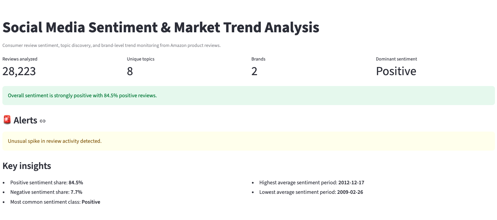
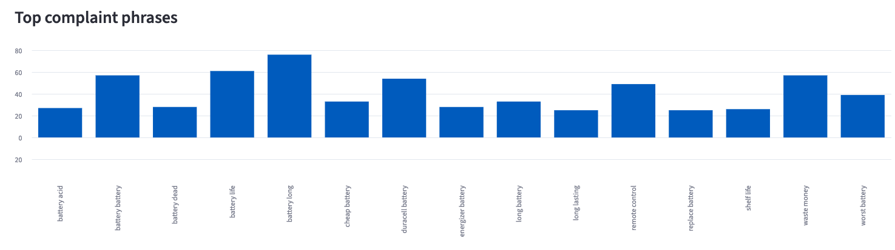
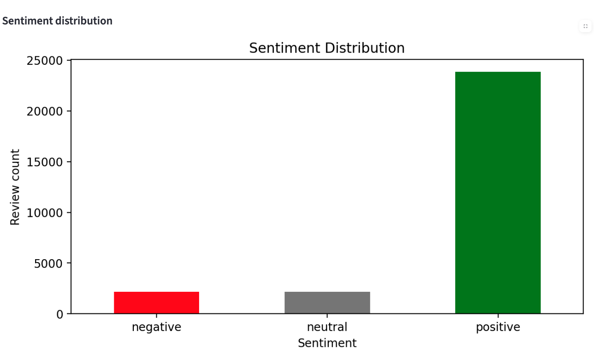

#  Social Media Sentiment & Market Trend Analysis Dashboard

An end-to-end machine learning and NLP system for analyzing large-scale product reviews, extracting complaint patterns, and uncovering market trends through an interactive dashboard.

---

##  Overview

This project transforms raw customer review data into actionable insights by combining sentiment classification, natural language processing, trend analysis, and interactive visualization.

The system processes **28,000+ product reviews** and identifies key signals such as customer dissatisfaction, product weaknesses, and brand perception.

---

##  Key Features

### Sentiment Analysis

* TF-IDF + Logistic Regression model
* Classifies reviews into **positive, neutral, and negative sentiment**
* Evaluated using accuracy, F1-score, and confusion matrix

---

###  Complaint Phrase Extraction (NLP)

* Custom text preprocessing (regex + stopwords)
* N-gram (bigram) extraction
* Phrase normalization and cleaning

**Example insights:**

* battery life
* battery dead
* waste money
* cheap battery

---

###  Trend Analysis

* Sentiment over time
* Detection of spikes in review activity
* Identification of peak negative sentiment periods

---

###  Brand & Product Insights

* Brand-level sentiment comparison
* Identification of worst-performing products
* Detection of competitor mentions (e.g., Duracell vs Energizer)

---

###  Interactive Dashboard (Streamlit)

* Real-time filtering and exploration
* Visualizations:

  * Sentiment distribution
  * Complaint phrases
  * Time-series trends
  * Brand ranking

---

## Dashboard Preview

<p align="center">
  
</p>

<p align="center">
  
  
</p>

---

##  Tech Stack

* Python
* Pandas / NumPy
* Scikit-learn
* NLP (regex, n-grams, stopwords)
* Streamlit

---

##  Project Structure

```text
src/
├── app.py               # Streamlit dashboard
├── train.py             # Model training
├── preprocess.py        # Text cleaning
├── topics.py            # Topic modeling
├── trends.py            # Trend analysis
├── pipeline.py          # End-to-end workflow
```

---

##  How to Run

```bash
git clone https://github.com/Padmore-Nana-Prempeh/sentiment-analysis-dashboard.git
cd sentiment-analysis-dashboard

pip install -r requirements.txt

streamlit run src/app.py
```

---

##  Key Results

* Processed **28,000+ reviews**
* Built a full pipeline from raw data to insights
* Extracted high-impact complaint patterns from unstructured text
* Developed an interactive dashboard for exploration

---

##  Business Impact

This system can be used to:

* Detect product failures early
* Monitor customer sentiment in real time
* Identify key drivers of negative feedback
* Compare brand performance
* Support product improvement decisions

---

##  Future Improvements

* Deploy dashboard (Streamlit Cloud)
* Upgrade to transformer-based models (BERT)
* Add real-time data ingestion
* Implement TF-IDF weighted phrase ranking
---

##  Author
 HEAD

**Padmore Nana Prempeh**


